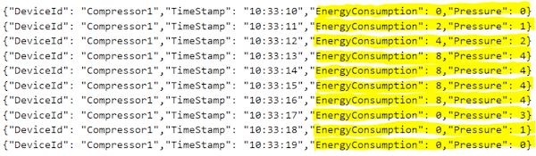
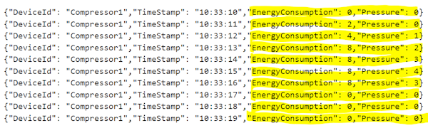
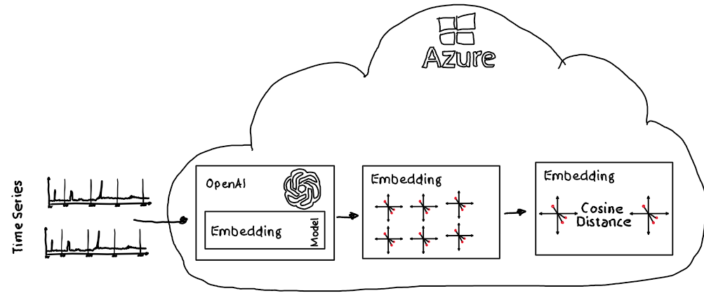
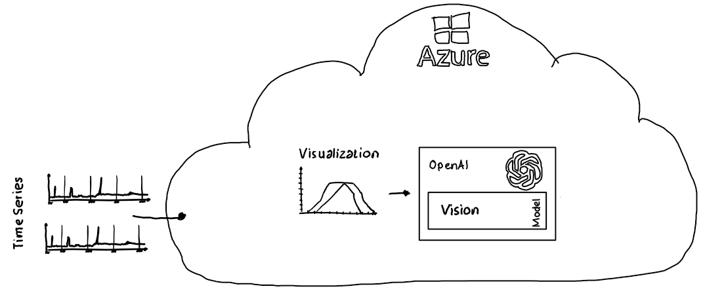
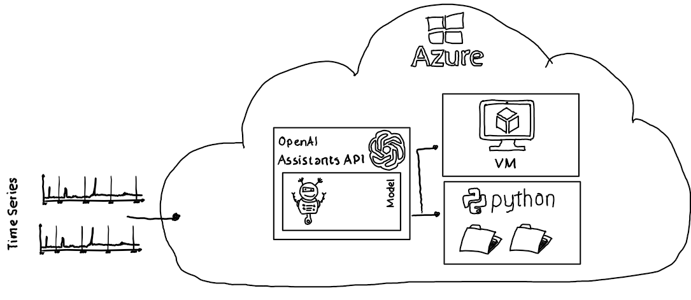

# OpenAI - Anomaly Detection

## Intro & Repo Content

With the advent of foundation models, particularly multi-modal models, a multitude of new opportunities has emerged for tasks traditionally handled by specialized AI models.

In this sample repository, three innovative approaches are demonstrated, showcasing how foundation models can be harnessed for anomaly identification in time series data.

These approaches include:

- leveraging **embeddings** for feature extraction of relevant columns in time series data, 
- and integrating **multi-modal** usage, specifically the capabilities of LLMs to use image data as input, to enhance detection accuracy
- using **tools** extensions of LLMs, specifically the code interpreter tool provided by the Azure OpenAI Assistants API,

thus illustrating the expansive potential and flexibility of foundation models in diverse applications.

## Time Series Data

All three approaches utilize two files containing time series data, which can range from application logs to telemetry data streams from devices or user behavior patterns.

Each sample employs one file that captures the default behavior and another that includes time series data where anomalies need to be detected, demonstrating the versatility and effectiveness of foundation models in identifying irregularities across various data streams.

### Reference Data

For this simplified sample, we are using [time series data](./TestData/TestData/TestData_Reference.txt) from a fictitious device called Compressor1, which records a time stamp, current pressure, and current energy consumption. Over the first three seconds, both energy consumption and the pressure produced by the device increase. This is followed by a period of four data points where both energy consumption and pressure remain stable. In the final three data points, energy consumption drops to zero, and the pressure gradually decreases. This pattern reflects the operational dynamics of Compressor1 over the observed time period.

### Anomaly Data

A compressor that requires maintenance, such as cleaning of a filter, may consume the same amount of energy but fail to produce the same level of pressure. This is evident in the test data, where despite consistent energy consumption, the pressure fails to reach its highest level over four consecutive data points, indicating a drop in efficiency and the need for maintenance.

## Anomaly Detection Strategies

### Embeddings

Embeddings are used to extract the semantic meaning of time series data, transforming it into a format that captures underlying patterns and relationships. After creating these embeddings, the cosine distance between the reference data and the anomaly data set is measured. The closer the distance to the reference data, the less likely it is to be an anomaly, allowing for effective detection of irregularities based on semantic similarity.

Check out the corresponding [sample here](./src/AnomalyDetection.Notebook/AnomalyDetection-Embedding.ipynb).

### OpenAI Multi Modal

Data from both the reference time series file and the file containing the anomaly are converted into graphical representations or charts. These charts, alongside a question asking if an anomaly is visible, are then provided to a multi-modal large language model (LLM). This approach leverages the LLM's capability to analyze visual data and interpret complex patterns, enabling it to effectively identify and confirm the presence of anomalies based on the visualized information.

Check out the corresponding [sample here](./src/AnomalyDetection.Notebook/AnomalyDetection-GPT4Vision.ipynb).

### Tools (code interpreter)

The OpenAI Assistants API offers the flexibility to integrate custom tools and includes a built-in code interpreter tool capable of writing and executing code to address specific challenges. When the two files containing time series data are provided to the Assistants API, the LLM can generate code to analyze these datasets, facilitating comprehensive anomaly detection by leveraging its programming and code execution capabilities.

Check out the corresponding [sample here](./src/AnomalyDetection.Notebook/AnomalyDetection-Assistant.ipynb).
